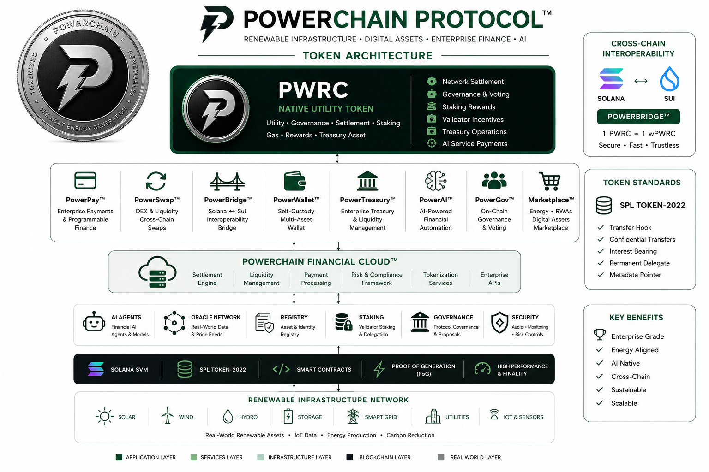

# PowerChain (PWRC)™

<p align="center">


<br>


</p>

<h1 align="center">
PowerChain Protocol™
</h1>

<p align="center">

### Enterprise Blockchain for Renewable Infrastructure, AI & Digital Finance

**Renewable Infrastructure • Digital Assets • Enterprise Finance • AI**

The enterprise blockchain platform powering programmable finance, renewable infrastructure, AI-native financial services, tokenized real-world assets, and cross-chain interoperability.

Built on **Solana** • Powered by **Proof of Generation (PoG)**

</p>

---

# Table of Contents

- Overview
- Vision
- Why PowerChain?
- Product Ecosystem
- Protocol Architecture
- PWRC Token
- Cross-Chain Assets
- Technology Stack
- Repository Structure
- Getting Started
- Documentation
- Roadmap
- Contributing
- License

---

# Overview

PowerChain Protocol™ is an enterprise blockchain ecosystem built on **Solana**, enabling programmable finance, renewable infrastructure, AI-native financial services, tokenized real-world assets (RWAs), enterprise payments, and cross-chain interoperability.

PowerChain combines blockchain infrastructure, enterprise finance, artificial intelligence, digital payments, treasury management, and renewable infrastructure into a unified programmable platform powered by **PWRC**, the native protocol asset.

Designed for enterprises, developers, utilities, financial institutions, governments, and infrastructure operators, PowerChain provides the foundation for building secure, scalable, and sustainable digital economies.

---

# Vision

PowerChain is building the financial operating system for renewable infrastructure.

The protocol connects:

- Renewable Energy
- Enterprise Payments
- Treasury Management
- Digital Assets
- AI Agents
- Carbon Markets
- Tokenized Infrastructure
- Cross-Chain Liquidity

into one enterprise blockchain platform.

---

# Why PowerChain?

- Enterprise-grade blockchain platform
- Solana SVM performance
- SPL Token-2022 assets
- AI-native financial infrastructure
- Renewable energy settlement
- Tokenized infrastructure & RWAs
- Institutional treasury platform
- Cross-chain interoperability
- Enterprise APIs & SDKs
- Open architecture
- Cloud-native infrastructure
- Developer-first ecosystem

---

# Product Ecosystem

| Product | Description |
|----------|-------------|
| 🪙 **PWRC** | Native utility, governance, staking and settlement token |
| 💳 **PowerPay™** | Enterprise payments & programmable finance |
| 🔄 **PowerSwap™** | Digital asset exchange & liquidity |
| 🌉 **PowerBridge™** | Solana ↔ Sui interoperability |
| 👛 **PowerWallet™** | Secure self-custody wallet |
| 🏦 **PowerTreasury™** | Enterprise treasury management |
| 🤖 **PowerAI™** | AI-powered financial automation |
| ⚡ **GridOS™** | Renewable infrastructure operating platform |
| 🗳 **PowerGov™** | Governance & staking |
| 🛒 **Marketplace™** | Renewable energy & digital asset marketplace |

---

# Protocol Architecture

<p align="center">

<a href="./assets/architecture/token-architecture.png">



</a>

</p>

<p align="center">

</p>

---

# PWRC Token

PWRC is the native protocol asset securing every application within the PowerChain ecosystem.

### Utilities

- Network settlement
- Governance voting
- Validator incentives
- Staking
- Enterprise payments
- Treasury operations
- Marketplace settlement
- AI service payments
- Renewable infrastructure settlement
- Cross-chain liquidity

---

# Network Specifications

| Property | Value |
|----------|-------|
| Network | Solana |
| Standard | SPL Token-2022 |
| Symbol | PWRC |
| Decimals | 9 |
| Maximum Supply | **18,440,000,000 PWRC** |
| Consensus | Proof of Generation (PoG) |

---

# Cross-Chain Assets

| Asset | Network | Supply |
|---------|----------|-------------------------|
| **PWRC** | Solana | **18.44 Billion Fixed Supply** |
| **wPWRC** | Sui | 1:1 Wrapped Representation |

PowerBridge™ securely locks native **PWRC** on Solana and mints **wPWRC** on the Sui Network. Every wrapped token is backed 1:1 by locked PWRC and can be redeemed through the bridge.

---

# Technology Stack

## Frontend

- Next.js
- React
- TypeScript
- Tailwind CSS

## Backend

- Node.js
- Fastify
- TypeScript

## Blockchain

- Solana
- Rust
- Anchor
- SPL Token-2022

## APIs

- REST API
- GraphQL
- WebSockets

## Infrastructure

- Docker
- Kubernetes
- GitHub Actions
- OpenTelemetry

---

# Repository Structure

```text
.
├── apps/
│   ├── portal/
│   ├── dashboard/
│   ├── developer/
│   └── docs/
│
├── packages/
│   ├── powerpay/
│   ├── powerswap/
│   ├── powerbridge/
│   ├── powerwallet/
│   ├── powertreasury/
│   ├── powergov/
│   ├── powerai/
│   └── shared/
│
├── programs/
├── contracts/
├── sdk/
├── apis/
├── docs/
├── examples/
├── assets/
│   ├── architecture/
│   ├── branding/
│   ├── diagrams/
│   ├── icons/
│   └── screenshots/
│
└── README.md
```

---

# Getting Started

```bash
git clone https://github.com/powerchain-protocol/tokens.git

cd tokens

npm install

npm run build

npm test
```

---

# Documentation

## Protocol

- Architecture
- Tokenomics
- Governance
- Staking
- Security
- Whitepaper

## Products

- PowerPay™
- PowerSwap™
- PowerBridge™
- PowerWallet™
- PowerTreasury™
- PowerAI™
- Marketplace™

## Developers

- SDK
- REST API
- GraphQL API
- WebSocket API
- CLI
- Smart Contracts
- Examples
- Developer Portal™

---

# Roadmap

| Phase | Status |
|---------|---------|
| PWRC Protocol | ✅ Complete |
| SDK & APIs | ✅ Complete |
| Developer Portal™ | ✅ Complete |
| PowerWallet™ | 🚧 In Progress |
| PowerPay™ | 🚧 In Progress |
| PowerSwap™ | 🚧 In Progress |
| PowerBridge™ | 🚧 In Progress |
| Marketplace™ | 🔜 Planned |
| PowerTreasury™ | 🔜 Planned |
| AI Financial Agents | 🔜 Planned |

---

# Contributing

We welcome contributions from developers, enterprises, researchers, and the open-source community.

Please review **CONTRIBUTING.md** before submitting pull requests or issues.

---

# License

Licensed under the **Apache License 2.0**.

---

<p align="center">

## PowerChain Protocol™

### Renewable Infrastructure • Digital Assets • Enterprise Finance • AI

**Powered by PWRC • Built on Solana • Secured by Proof of Generation (PoG)**

---

**Official Resources**

🌐 Website: https://powerchain.energy

📚 Documentation: https://docs.powerchain.energy

💻 GitHub: https://github.com/powerchain-protocol

</p>
