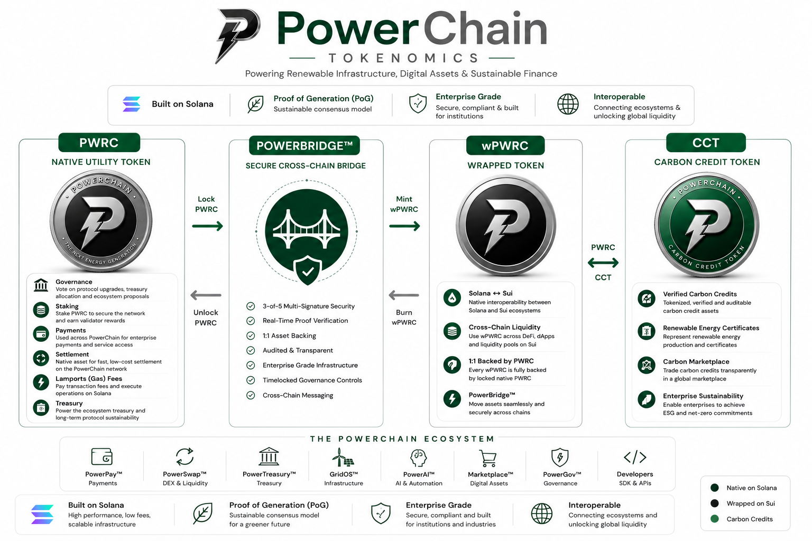

<p align="center">
  
</p>

<h1 align="center">PWRC</h1>

<p align="center">
<b>Native Utility Token of the PowerChain Protocol™</b>
</p>

<p align="center">
Renewable Infrastructure • Digital Assets • Enterprise Finance • AI
</p>

<p align="center">
Built on <b>Solana</b> • SPL Token-2022 • Fixed Supply
</p>

<p align="center">


</p>

---

# Overview

PWRC is the native utility, settlement, staking, and governance token of the **PowerChain Protocol™**.

Designed for enterprise-scale financial infrastructure, PWRC powers programmable payments, renewable energy markets, AI-native financial services, tokenized real-world assets (RWAs), and cross-chain liquidity.

Built on **Solana** using the **SPL Token-2022** standard, PWRC is the foundational asset securing every PowerChain application, protocol, and cloud service.

---

# Ecosystem Tokens Architecture

<p align="center">



</p>

---

# Table of Contents

- Overview
- Architecture
- Core Features
- Token Utility
- Token Specifications
- Tokenomics
- Distribution
- Vesting
- Staking
- Governance
- PowerBridge™
- wPWRC
- Technology
- Repository Structure
- Documentation
- Roadmap
- Disclaimer
- License

---

# Core Features

- Fixed maximum supply of **18.44 Billion PWRC**
- Built on Solana
- SPL Token-2022
- Native settlement asset
- Enterprise payment token
- Governance-enabled
- Validator staking
- Renewable infrastructure settlement
- AI service payments
- Treasury reserve asset
- Marketplace settlement
- Cross-chain interoperability
- Proof of Generation (PoG)

---

# Token Utility

PWRC powers every layer of the PowerChain ecosystem.

| Utility | Description |
|----------|-------------|
| Payments | Enterprise and protocol settlement |
| Treasury | Treasury reserve asset |
| Staking | Validator and protocol staking |
| Governance | DAO voting |
| AI Services | AI compute and automation payments |
| Marketplace | Digital asset settlement |
| Renewable Energy | Energy settlement and incentives |
| Carbon Markets | Carbon asset settlement |
| Cross-chain Liquidity | Bridge collateral |
| Ecosystem Rewards | Community incentives |

---

# Token Specifications

| Property | Value |
|-----------|-------|
| Name | PowerChain |
| Symbol | PWRC |
| Network | Solana |
| Token Standard | SPL Token-2022 |
| Decimals | 9 |
| Maximum Supply | **18,440,000,000 PWRC** |
| Inflation | None |
| Mint Authority | Disabled |
| Additional Minting | Never |
| Status | Fixed Supply |

---

# Tokenomics

## Maximum Supply

```
18,440,000,000 PWRC

✓ Fixed Supply

✓ No Inflation

✓ Mint Disabled

✓ No Additional Issuance
```

---

# Distribution

| Allocation | Percentage |
|------------|-----------:|
| Community & Ecosystem | 35% |
| Treasury Reserve | 20% |
| Staking Rewards | 15% |
| Core Team | 12% |
| Strategic Partners | 8% |
| Liquidity | 5% |
| Public Distribution | 3% |
| Marketing | 2% |

---

# Vesting

| Allocation | Cliff | Vesting |
|------------|-------|----------|
| Core Team | 12 Months | 36 Months |
| Strategic Partners | 6 Months | 24 Months |
| Treasury | DAO Managed | Long-Term |
| Community | Programme Based | Ongoing |

---

# Staking

PWRC holders may stake tokens to:

- Secure validators
- Support protocol decentralisation
- Earn staking rewards
- Participate in governance
- Support renewable infrastructure

Reward sources may include:

- Protocol service fees
- Validator incentives
- Treasury programmes
- Governance-approved rewards

---

# Governance

PWRC provides governance rights within **PowerGov™**.

Governance proposals may include:

- Treasury allocation
- Protocol upgrades
- Validator policies
- Ecosystem grants
- Fee parameters
- Staking configuration
- Community proposals

---

# PowerBridge™

PowerBridge™ provides secure interoperability between Solana and the Sui Network.

| Network | Asset |
|----------|-------|
| Solana | PWRC |
| Sui | wPWRC |

Bridge operations include:

- Lock native PWRC
- Mint wPWRC
- Burn wPWRC
- Unlock PWRC

---

# wPWRC

wPWRC is the official wrapped representation of PWRC on the **Sui Network**.

| Property | Value |
|-----------|-------|
| Name | Wrapped PowerChain |
| Symbol | wPWRC |
| Network | Sui |
| Decimals | 9 |
| Supply | Dynamic |
| Backing | 1:1 Native PWRC |

Every wPWRC is fully collateralised by native PWRC locked through **PowerBridge™**.

> **Native PWRC always maintains the fixed maximum supply of 18.44 billion tokens.**

---

# Technology

## Blockchain

- Solana
- SPL Token-2022
- Proof of Generation (PoG)

## Smart Contracts

- Rust
- Anchor Framework

## Infrastructure

- PowerBridge™
- Oracle Network
- Registry Services
- PowerChain Financial Cloud™

---

# Repository Structure

```text
.
├── README.md
├── LICENSE
│
├── assets/
│   ├── branding/
│   ├── architecture/
│   ├── tokenomics/
│   └── diagrams/
│
├── docs/
│   ├── tokenomics.md
│   ├── staking.md
│   ├── governance.md
│   ├── bridge.md
│   ├── wpwrc.md
│   ├── security.md
│   └── faq.md
│
├── metadata/
├── bridge/
├── scripts/
├── examples/
└── contracts/
```

---

# Documentation

### Token

- Token Overview
- Tokenomics
- Supply Model
- Distribution
- Vesting

### Network

- Staking
- Governance
- PowerBridge™
- wPWRC
- Security

### Developers

- SPL Token-2022
- Metadata
- Smart Contracts
- SDK Examples
- API Reference

---

# Roadmap

| Feature | Status |
|----------|--------|
| PWRC Token | ✅ Complete |
| Metadata | ✅ Complete |
| Documentation | ✅ Complete |
| Staking | 🚧 In Progress |
| Governance | 🚧 In Progress |
| PowerBridge™ | 🚧 In Progress |
| wPWRC | 🚧 In Progress |
| Exchange Integrations | 🔜 Planned |
| Institutional Custody | 🔜 Planned |

---

# Disclaimer

PWRC is designed as a utility, settlement, staking, and governance token within the PowerChain ecosystem.

This repository is provided for informational and development purposes only and does not constitute financial, investment, legal, or tax advice.

Protocol parameters, governance mechanisms, token allocations, and roadmap items may evolve through approved governance processes.

---

# License

Licensed under the **Apache License 2.0**.

---

<p align="center">

## PWRC

### Native Utility Token of the PowerChain Protocol™

**Fixed Maximum Supply**

**18,440,000,000 PWRC**

Built on **Solana** • SPL Token-2022

wPWRC is the official wrapped representation of PWRC on the **Sui Network**, backed **1:1** through **PowerBridge™**.

</p>
